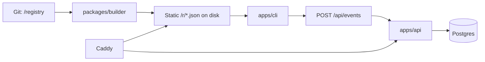

# Framebits

Curated platform distributing animated React components, installable with our own CLI: `npx framebits add <slug>`.

> Git is the source of truth. The database is only an index and a stats store. Static files on disk are the delivery mechanism.

## Monorepo layout

- `apps/api` — Hono server
- `apps/cli` — the `framebits` npm package
- `apps/web` — placeholder (out of scope)
- `packages/shared` — Zod schemas + inferred types
- `packages/db` — Drizzle schema, migrations, db client, seed/sync
- `packages/builder` — registry build pipeline
- `packages/config` — shared tsconfig, eslint config
- `registry/components/<category>/<slug>/` — component sources
- `registry/lib/<slug>/` — shared helpers
- `deploy/` — docker-compose, Caddyfile, deploy scripts

## Setup

```sh
pnpm i
pnpm build
pnpm lint
pnpm typecheck
pnpm test
```

Node >= 22, pnpm only.

> Windows note: deploy scripts are bash/POSIX. Develop inside WSL2 or Git Bash
> so shell scripts keep LF line endings (enforced by `.gitattributes`).

## Architecture



Reading components (CLI/website) never hits the API or DB — served as static files by Caddy.

## Docs

- `CONTRIBUTING.md` — how to add a component (see Task 6+; generator: `pnpm new-component <slug> --category=<cat>`)
- `deploy/README.md` — VPS setup, hardening, backup/restore

<!-- TODO(question): confirm production DOMAIN (currently framebits.dev placeholder, defined once in packages/shared/src/site.ts) and CLI default registry URL. -->
<!-- TODO(question): choose a license before public launch (repo is private until then; no LICENSE file yet). -->
