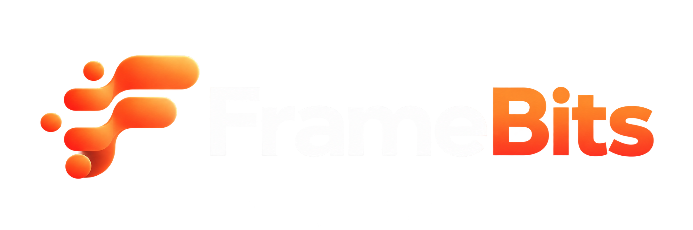
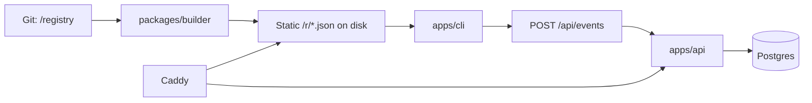

<p align="center">
  
</p>

<h3 align="center">Curated animated React components — installed with one command.</h3>

<p align="center">
  <a href="https://github.com/sponsors/otassh"></a>
  = 22" />
  
  <a href="https://github.com/otassh/framebits/actions"></a>
</p>

`npx framebits add <slug>` drops a hand-reviewed, animated component straight into your project — no boilerplate, no lock-in. Git is the source of truth; the database is only an index. Components ship as static files, so installs stay fast even when the API is down.

## ✨ Features

- **One-command install** — `framebits init` detects your setup (package manager, TypeScript, Tailwind, import aliases), `framebits add <slug>` does the rest
- **Safe by default** — SHA-256 hash verification, dependency allow-lists, atomic writes with automatic rollback
- **Zero-config styling** — Tailwind CSS is patched automatically; `--dry-run` previews every change first
- **Smart dependencies** — registry dependencies resolve transitively (e.g. `aurora-text` pulls in `cn`), missing npm packages are installed for you
- **Static-first registry** — components are served as static JSON, verified independently of the API or database

## 🚀 Quick start

```sh
npx framebits init
npx framebits add aurora-text
```

Or install globally and use it anywhere:

```sh
npm i -g framebits
framebits add aurora-text --dry-run   # preview the plan, change nothing
```

Requires Node >= 20. See [`apps/cli/README.md`](apps/cli/README.md) and [`docs/CLI.md`](docs/CLI.md) for all commands, flags, and exit codes.

## 📦 What's inside

| Path | Description |
| ---- | ----------- |
| `apps/api` | Hono server (events, stats) |
| `apps/cli` | The `framebits` npm package — init, add, registry client |
| `apps/web` | Placeholder (out of scope) |
| `packages/shared` | Zod schemas + inferred types (single source of truth) |
| `packages/db` | Drizzle schema, migrations, DB client, seed/sync |
| `packages/builder` | Registry build pipeline (validate → hash → emit) |
| `packages/config` | Shared tsconfig + eslint config |
| `registry/components/<category>/<slug>/` | Component sources |
| `registry/lib/<slug>/` | Shared helpers |
| `deploy/` | Docker Compose, Caddyfile, deploy scripts |

## 🏗 Architecture



Reading components never hits the API or DB — they are served as static files by Caddy.

## 🛠 Development

```sh
pnpm i
pnpm build
pnpm lint
pnpm typecheck
pnpm test
```

Node >= 22, pnpm only.

Releasing is owner-only, see [`docs/RELEASING.md`](docs/RELEASING.md).

<details>
<summary>Windows note</summary>

Deploy scripts are bash/POSIX. Develop inside WSL2 or Git Bash so shell scripts keep LF line endings (enforced by `.gitattributes`).

</details>

## 📚 Docs

- [`CONTRIBUTING.md`](CONTRIBUTING.md) — how to add a component (generator: `pnpm new-component <slug> --category=<cat>`)
- [`docs/CLI.md`](docs/CLI.md) — commands, target mapping, security model
- [`docs/CONTRACTS.md`](docs/CONTRACTS.md) — schemas and registry contracts
- [`deploy/README.md`](deploy/README.md) — VPS setup, hardening, backup/restore

## 💖 Sponsoring

If Framebits saves you or your company time, consider [sponsoring ongoing maintenance](https://github.com/sponsors/otassh).

## 📄 License

To be announced before public launch.
